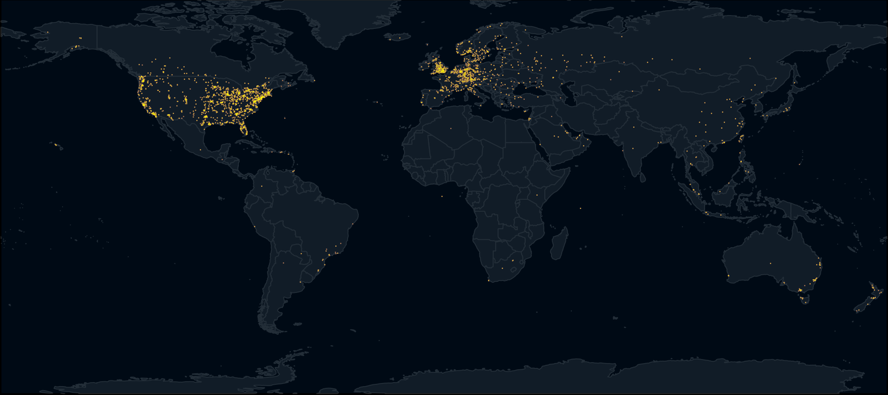

# fah-map

fah-map is an easily deployable node.js app to display recent activity within the Folding@home network. Included is `fahmap.py`, a tool to quickly generate a beautiful geographic heatmap from a database of Folding@home donor IP addresses.

`fahmap.py` is based on the unequivocally awesome [heatmap](https://github.com/sethoscope/heatmap) by [@sethoscope](https://github.com/sethoscope), and inspired by NASA's light pollution map:

